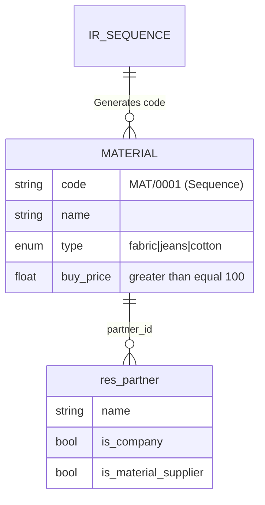

# Material Management

## Overview
This Odoo module manages materials and their related suppliers with the following features:
- Material registration with auto-generated codes
- Validation for minimum buy price
- Supplier relationship management
- REST API endpoints
- Comprehensive unit tests

## Entity Relationship Diagram


## Installation
1. Clone module to Odoo addons directory
2. Install dependencies:
   ```bash
   pip install -r requirements.txt
   ```
3. Install module in Odoo:
   ```bash
   ./odoo-bin -i material_management -d your_database
   ```

## Model Specifications

### Material Model
| Field | Type | Required | Description |
|-------|------|----------|-------------|
| code | Char | Auto | Auto-generated (MAT/0001) |
| name | Char | Yes | Material name |
| type | Selection | Yes | fabric/jeans/cotton |
| buy_price | Float | Yes | Must be ≥ 100 |
| supplier_id | Many2one | Yes | Related to res.partner table |

### API Endpoints

#### Create Material (POST)
```http
POST /api/materials
Content-Type: application/json

{
  "name": "Premium Cotton",
  "type": "cotton",
  "buy_price": 150,
  "supplier_id": 1
}
```

#### Response
```json
{
  "success": true,
  "id": 1,
  "code": "MAT/0001"
}
```

## Testing
Run tests with:
```bash
./odoo-bin --test-enable -d test_db --test-tags /material_management
```

### Test Cases
1. `test_create_material`: Valid material creation
2. `test_price_validation`: Price < 100 validation
3. `test_auto_code`: Sequence generation
4. `test_filter_by_type`: Material filtering

## Sequence Configuration
Configured in `data/sequence.xml`:
```xml
<record id="seq_material_code" model="ir.sequence">
  <field name="prefix">MAT/</field>
  <field name="padding">4</field>
</record>
```

## Troubleshooting
| Error | Solution |
|-------|----------|
| 400 Bad Request | Check request Content-Type |
| NULL constraint | Ensure all required fields are sent |
| Price validation | Buy price must be ≥ 100 |

I found some general error on odoo14, [this link](https://dev.to/jeevanizm/odoo-v14-and-issues-with-requirementstxt-2o23) maybe can help  you to solve the issue

## License
MIT License - See LICENSE file for details
```

Key features of this documentation:
1. Clear ERD visualization using Mermaid
2. Complete API specification with examples
3. Detailed model structure
4. Testing instructions
5. Sequence configuration details
6. Troubleshooting guide

The markdown format makes it easy to maintain and view in any markdown viewer or version control system like GitHub.
